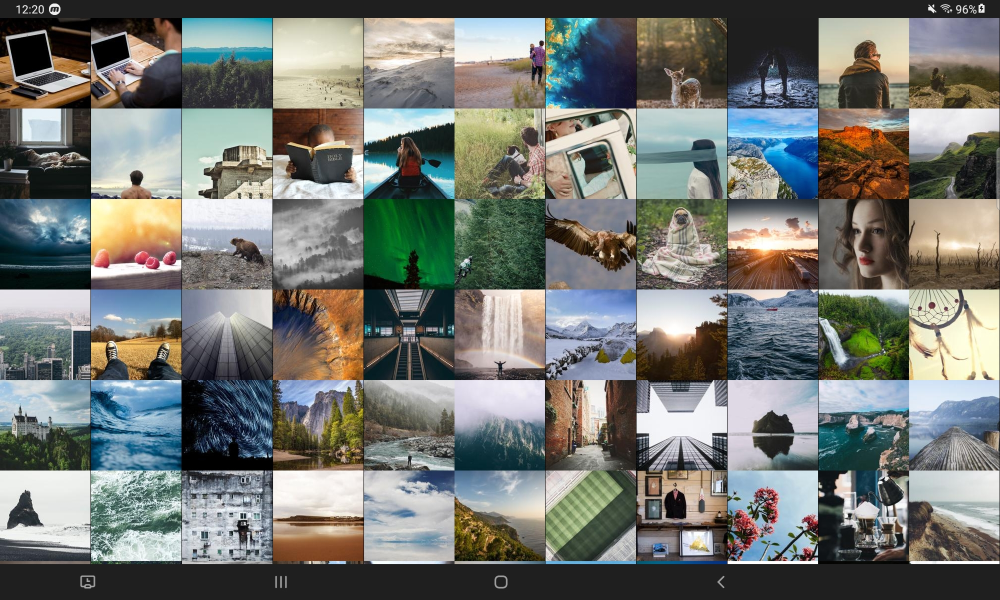

# Picsum-photos

### Image Load Sample App (Korean version)

삼성 갤러리 앱은 어떤식으로 만드는 것일까? Touch Scoll 에 따라 Column, Row 갯수가 변경되는, LayoutManager 을 만들어서 적용하는 것이 목표.

### Preview
| | | |
|:-------------------------:|:-------------------------:| :-------------------------:|
|| Phone | Tablet |
| Vertical | |   | |
| Horizontal | |  

### Version
MinSdkVersion : 21+

### Architecture
* MVVM Architecture (View - DataBinding - ViewModel - Model)
* Repository Pattern

### Modularization
* App, Core, Domain, Data, BuildSrc

### 🛠 Built With 🛠
* Kotlin (Coroutine, Flow)
* Dagger-Hilt
  * 의존성 주입을 위해 사용
* Material-design
  * [AlertController](https://android.googlesource.com/platform/frameworks/base.git/+/master/core/java/com/android/internal/app/AlertController.java)
* Jetpack
  * Lifecycle
  * ViewModel
    * 화면 전환이나, 디스플레이 확대 축소 등의 다양한 구성요소 변경에도 데이터를 보존하기 위해 사용.
  * DataBinding 
    * UI 와 상태를 일치시키기 위해 사용.
  * Room
    * RemoteMediator 를 활용하여, 네트워크 환경이 좋지 않거나, 오프라인 환경에서 사용자에게 더 나은 경험을 제공하기 위해 사용.
  * Paging3
    * PagingState(상태) 가 제공되기 때문에 header, footer 에러 처리에 따른 재시도 등을 쉽게 구현할 수 있어 사용.
  * App Startup
    * 다른 토이 프로젝트에서 콜드 스타트 벤치마크를 10회 돌려본 결과, 20% 이상 시간이 감소하여 사용.
* Retrofit, OkHttp
* Kotlinx-serialization
  * 기본 값을 넣을 수 있고, Gson 보다 type 관련해서 엄격하게 사용할 수 있어서 활용.
* Coil
  * 이미지를 로드할 때 코루틴의 장점을 활용할 수 있고, Interceptor 를 활용하여 ViewTarget 인 경우, 요청하는 View 의 사이즈만큼만 가져올 수 있도록 하여, 메모리, 파일 캐시 등의 이점을 얻을 수 있음.
* Timber
  * 로깅 
* [Ubsampling-scale-image-view](https://github.com/davemorrissey/subsampling-scale-image-view)
  * [BitmapRegionDecoder](https://github.com/davemorrissey/subsampling-scale-image-view/blob/master/library/src/main/java/com/davemorrissey/labs/subscaleview/decoder/SkiaImageRegionDecoder.java#L37) 
을 사용하여, 이미지 전체를 가져오는 것이 아닌 부분적으로 가지고 오기 때문에, 매우 큰 이미지도 열화 현상 없이 보여줄 수 있어서 사용.
(보통 21 이상 버전에서는 4096 x 4096 까지 opengles 가 그려낼 수 있음)
* Testing
  * kotlinx-coroutines-test
  * core-testing
  * hamcrest-library
  * Junit
  * mockito 
